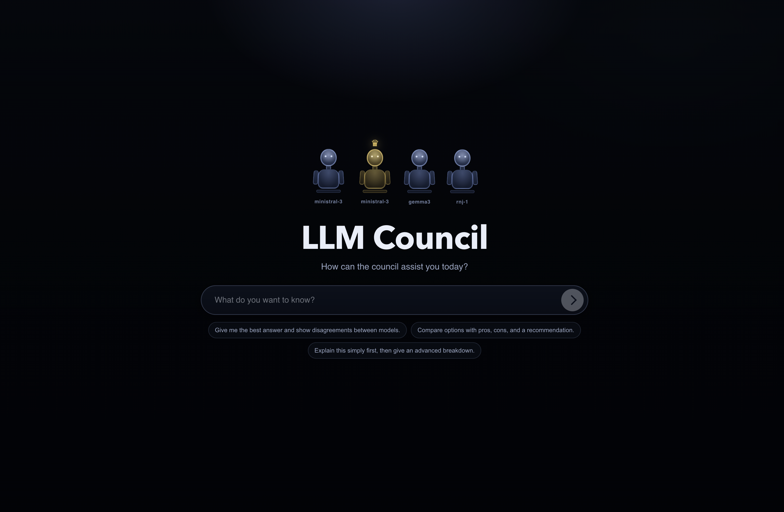

# LLM Council

## Introduction



LLM Council is a local-first web app that runs the same prompt through multiple Ollama models, has them critique and rank each other, then produces a final synthesized answer from a designated chairman model.

## Inspiration

This project extends the multi-model collaboration direction explored by @karpathy.

The council-style workflow, peer critique, and chairman synthesis pattern were inspired by that line of thinking, with a modified implementation and hybrid local/cloud runtime built independently in this repository.

## What It Does

- Runs one user prompt across multiple models (`COUNCIL_MODELS`)
- Shows each model's raw answer (Stage 1)
- Runs anonymized peer ranking across model outputs (Stage 2)
- Streams the chairman's final synthesis token-by-token (Stage 3)
- Stores conversations as JSON files on disk
- Auto-generates conversation titles from the first user message

## Hybrid Ollama Approach (Local or Cloud)

LLM Council uses a hybrid runtime approach: users can choose **either** local Ollama **or** Ollama Cloud for the same council workflow.

- `OLLAMA_MODE=local`: queries your local Ollama server (default: `http://localhost:11434`)
- `OLLAMA_MODE=cloud`: queries Ollama Cloud endpoint (default: `https://ollama.com/api/chat`)

### Why this hybrid setup is useful

- Local mode: better privacy, lower per-request cost, works offline once models are available.
- Cloud mode: easier access to hosted models without local GPU constraints.
- Same UI and same 3-stage council logic in both modes.

### Important runtime behavior

- You select one mode at a time via `.env`.
- `COUNCIL_MODELS` must match the selected mode.
- In local mode, models must be installed in your local Ollama instance.
- In cloud mode, model IDs must be valid cloud-available model IDs for your account.
- If `OLLAMA_MODE=cloud` and `OLLAMA_CLOUD_API_KEY` is missing, requests will fail and the UI shows a warning.

## How the Council Votes and Decides

The app does not simply pick one “winning” model answer. Instead, it runs a multi-stage deliberation and synthesis process.

### Stage 1: Individual Responses

1. The user prompt is sent to every model in `COUNCIL_MODELS`.
2. Responses are collected in parallel.
3. Failed model calls are skipped; successful outputs are kept.

Output: a list of raw model responses (`model`, `response`).

### Stage 2: Peer Review and Voting

1. Stage 1 responses are anonymized as `Response A`, `Response B`, etc.
2. Each model receives all anonymized responses and evaluates strengths and weaknesses of each response.
3. Each model then provides a strict final ranking from best to worst.
4. Rankings are parsed from each model output.
5. Aggregate ranking is computed by averaging rank position across reviewers.

Output:

- per-model ranking writeups (`stage2`)
- parsed rankings
- aggregate ranking table (average rank, lower is better)

This is the “voting” step: every model acts as a reviewer/judge of the full response set.

### Stage 3: Final Decision and Synthesis

1. The chairman model receives the original user question, all Stage 1 responses, and all Stage 2 ranking analyses.
2. It generates a final synthesized answer that aims to combine the strongest points and resolve disagreements.
3. The UI streams this final answer token-by-token over SSE (`/message/stream`).

Decision rule in practice:

- The final answer shown to the user is the **chairman synthesis**, not a raw top-ranked Stage 1 response.
- Stage 2 voting influences the chairman prompt context.
- If chairman synthesis fails, the backend falls back to the first available Stage 1 response.

## Tech Stack

- Backend: FastAPI, httpx, uvicorn, python-dotenv
- Frontend: React 19 + Vite + react-markdown
- Runtime: Ollama local or Ollama Cloud
- Storage: JSON files in `data/conversations/`

## Requirements

- Python 3.10+
- [uv](https://docs.astral.sh/uv/)
- Node.js 18+ and npm
- Ollama (local mode) or Ollama Cloud API key (cloud mode)

## Setup

### 1. Install dependencies

```bash
make install
```

Equivalent manual install:

```bash
uv sync
cd frontend && npm install
```

### 2. Configure environment

Create a `.env` file in the repo root.

Local mode example:

```env
OLLAMA_MODE=local
OLLAMA_API_URL=http://localhost:11434
COUNCIL_MODELS=model-a,model-b,model-c
CHAIRMAN_MODEL=model-b
TITLE_MODEL=model-a
```

Cloud mode example:

```env
OLLAMA_MODE=cloud
OLLAMA_CLOUD_API_URL=https://ollama.com/api/chat
OLLAMA_CLOUD_API_KEY=your_api_key_here
COUNCIL_MODELS=your-cloud-model-1,your-cloud-model-2
CHAIRMAN_MODEL=your-cloud-model-1
TITLE_MODEL=your-cloud-model-1
```

### 3. If using local Ollama, start service and pull models

```bash
ollama serve
# Pull the models you configured in COUNCIL_MODELS
ollama pull model-a
ollama pull model-b
ollama pull model-c
```

Switching modes later is just updating `.env` and restarting the backend.

### 4. Run the app

```bash
make dev
```

- Backend: `http://localhost:8001`
- Frontend: `http://localhost:5173`

## Development Commands

- `make dev`: run backend + frontend together
- `make backend`: run backend only (`uvicorn` on port 8001)
- `make frontend`: run frontend only (Vite on port 5173)
- `make install`: install backend + frontend dependencies
- `make clean`: remove local build caches

## Environment Variables

| Variable | Description | Default |
| --- | --- | --- |
| `OLLAMA_MODE` | `local` or `cloud` | `local` |
| `OLLAMA_API_URL` | Local Ollama base URL (normalizes `/api/chat` or `/api/generate`) | `http://localhost:11434` |
| `OLLAMA_CLOUD_API_URL` | Ollama Cloud chat endpoint | `https://ollama.com/api/chat` |
| `OLLAMA_CLOUD_API_KEY` | API key used when `OLLAMA_MODE=cloud` | empty |
| `COUNCIL_MODELS` | Comma-separated model list used in Stage 1 and Stage 2 | set by user |
| `CHAIRMAN_MODEL` | Preferred Stage 3 synthesis model | first model in `COUNCIL_MODELS` |
| `TITLE_MODEL` | Model used for first-message conversation title generation | `CHAIRMAN_MODEL` |
| `DATA_DIR` | Conversation storage directory | `data/conversations` |

## API Endpoints

- `GET /`: health check
- `GET /api/runtime-config`: active runtime config exposed to UI
- `GET /api/conversations`: list conversation metadata
- `POST /api/conversations`: create conversation
- `GET /api/conversations/{id}`: fetch one conversation
- `POST /api/conversations/{id}/message`: run full 3-stage pipeline
- `POST /api/conversations/{id}/message/stream`: stream stage events (SSE)

## Notes

- In cloud mode, `COUNCIL_MODELS` must be valid cloud-available model IDs for your account.
- Stage 3 streaming is implemented with Server-Sent Events (SSE).
- Conversation files are plain JSON and can be inspected directly under `data/conversations/`.
